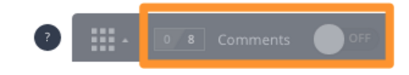
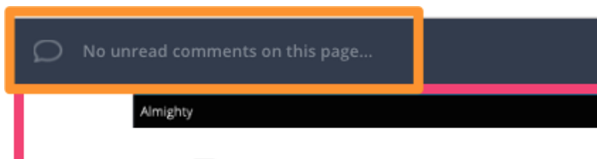
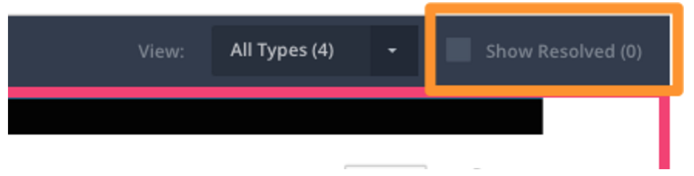
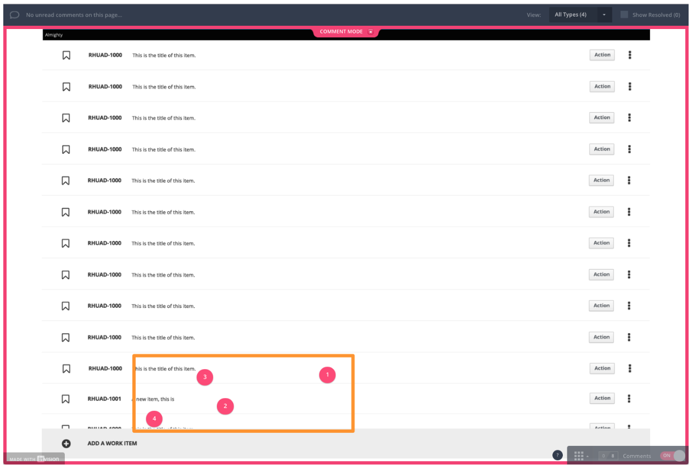
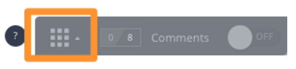

= InVision Walkthrough (link:../img/InVisionWalkthrough.pdf[PDF])

 For this walkthrough, we will be using the ALM_Desktop_SaveNew_and_Changes prototype.

Navigate to the shared link:https://redhat.invisionapp.com/share/6A8T2M2XB#/193330603_List[https://redhat.invisionapp.com/share/6A8T2M2XB#/193330603_List]

You will be presented with this screen:

image:../img/walkthrough-01.png[]

There are two key areas to look for - *Comments* and *View All*

== Comments

By default, commenting is turned off. If you wish to add comments to the screens that you are currently viewing, you need to turn them on.

=== Turning On Comments:

Click the ‘Off’ switch in order to turn commenting on.

When turning comments to ‘ON’, the entire screen outlines in pink, matching the comment bubbles.

image:../img/walkthrough-04.png[]

=== Comment Areas

Once you have Comments turned on, there are multiple areas of importance.

. Unread Comments
. Type of Comments
. Resolved Comments
. Active Comments

===== Unread Comments

If you are new to the screen, or have previously commented on sections, you can see all of the New/Unviewed comments here.

===== Type of Comments

image:../img/walkthrough-06.png[]

There are two types of views - *Comments* and *Tour Points* .

*Comments* are what we are focusing on - things that you wish to ask the creator or items that you would like the creator to look at further.

*Tour Points* are specific items that the creator has highlighted in order to direct the reviewer (you) through the prototype screen(s).

===== Resolved Comments

Resolved comments are comments that the creator has marked as resolved - either they have addressed the original commenter's thoughts, or they have communicated with the commenter properly in order to resolve what was done. Checking off this box shows those comments, so that you can see the historical path of the prototype screen.

===== Active Comments

Active comments are marked with a pink bubble, with a number inside. The number corresponds to the order in which the comments were made (#1 was first, #2 - second #3 - third, etc.).

== View All Screens

Sometimes, you want to view all of the screens that are part of a prototype, or you want to jump to a specific screen. You can do so by click the ‘View All’ button.

This will present all of the screens in a card view, with the current screen highlighted.

image:../img/walkthrough-10.png[]

** NOTE:* You cannot comment in this view. You will need to look at individual screens to add comments.